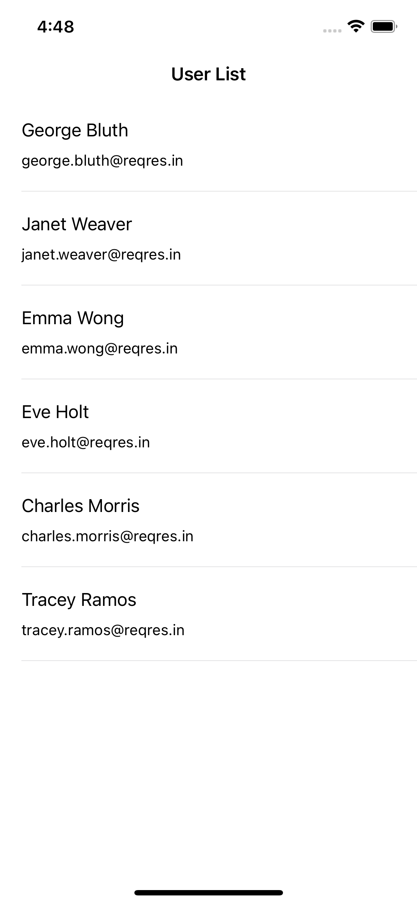
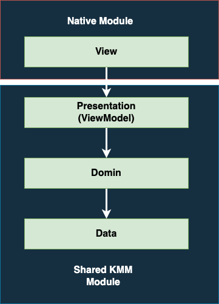
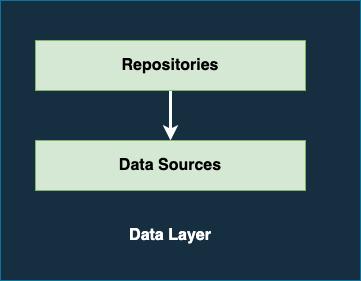
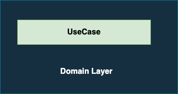
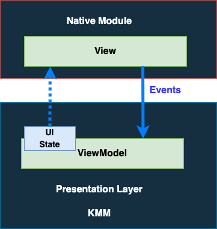

# Kotlin Multiplatform App Architecture

## Motivation

Ideally, we would want to build something very scalable yet very concise, easy to understand, and
simple to implement.

## Application

We have build the sample application to demonstrate the App Architecture.

Kindly go through the code to better understand the App Architecture.

| Android                                                          |                      iOS                       |
|------------------------------------------------------------------|:----------------------------------------------:|
|  |  |

**API**

We will be using [Reqres](https://reqres.in/) to fetch the Users and display it in UI.

https://reqres.in/api/users?page=1

**Response**

```
{
  "page": 1,
  "per_page": 6,
  "total": 12,
  "total_pages": 2,
  "data": [
    {
      "id": 1,
      "email": "george.bluth@reqres.in",
      "first_name": "George",
      "last_name": "Bluth",
      "avatar": "https://reqres.in/img/faces/1-image.jpg"
    },
    {
      "id": 2,
      "email": "janet.weaver@reqres.in",
      "first_name": "Janet",
      "last_name": "Weaver",
      "avatar": "https://reqres.in/img/faces/2-image.jpg"
    }
  ],
  "support": {
    "url": "https://reqres.in/#support-heading",
    "text": "To keep ReqRes free, contributions towards server costs are appreciated!"
  }
}
```

## App Architecture

We are following the App Architecture suggested bt Google.

Learn App Architecture from Android Developers website.

- [Guide to app architecture ](https://developer.android.com/topic/architecture)
- [Architecture - MAD Skills](https://www.youtube.com/playlist?list=PLWz5rJ2EKKc8GZWCbUm3tBXKeqIi3rcVX)



### Kotlin Multiplatform Module

kindly refer the **shared** module for source code.

#### Data Layer

The data layer of an app contains the business logic. The business logic is what gives value to our
app—it's made of rules that determine how your app creates, stores, and changes data.

The data layer is made of repositories that each can contain zero to many data sources. We should
create a repository class for each different type of data you handle in your app.



##### RemoteDataSource

The remote data source will be responsible for fetching the data from the REST APIs.

```kotlin
// UserRemoteDataSource.kt

class UserRemoteDataSource constructor(
    private val httpClient: HttpClient
) : BaseRemoteDataSource() {

    suspend fun getUsers(page: Int): List<User> {
        val userListResponse: UserListResponse = executeRemoteRequest {
            val url = Url("https://reqres.in/api/users?page=${page}")
            val response = httpClient.request(url = url)
            response
        }

        return userListResponse.data
    }
}
```

##### Repository

Repository modules handle data operations. They provide a clean API so that the rest of the app can
retrieve this data easily. We can consider repositories to be mediators between different data
sources, such as persistent models, web services, and caches.

```kotlin
// UserRepository.kt

class UserRepository constructor(
    private val userRemoteDataSource: UserRemoteDataSource
) : BaseRepository() {

    override suspend fun clearStore() {
        // NO-OP
    }

    suspend fun getUsers(page: Int): List<User> {
        return userRemoteDataSource.getUsers(page = page)
    }
}
```

#### Domain Layer

The domain layer is responsible for encapsulating complex business logic, or simple business logic
that is reused by multiple ViewModels.

Classes in this layer are commonly called use cases or interactors. Each use case should have
responsibility over a single functionality.



```kotlin
// GetUserListUseCase.kt

class GetUserListUseCase constructor(
    private val userRepository: UserRepository,
    dispatcher: CoroutineDispatcher
) : UseCase<GetUserListUseCase.Param, List<User>>(dispatcher) {

    data class Param(
        val page: Int
    )

    override suspend fun execute(parameters: Param): List<User> {
        return userRepository.getUsers(page = parameters.page)
    }
}
```

#### Presentation Layer (ViewModel)

The classes that are responsible for the production of UI state and contain the necessary logic for
that task

A ViewModel object provides the data for a specific UI component, such as a fragment or activity,
and contains data-handling business logic to communicate with the model.

From the platforms views we then have the ViewModel layer which is responsible for connecting our
shared data and the views.



**Creating Base ViewModel**

To enable sharing of presentation logic between platforms, we
define `expect abstract class ViewModel`
in `commonMain`, with platform specific implementations provided in `androidMain` and `iosMain`.

```kotlin
// commonMain - ViewModel.kt

expect abstract class ViewModel() {

    val viewModelScope: CoroutineScope

    protected open fun onCleared()
}
```

The android implementation simply extends the Jetpack ViewModel. We don't want to manage the
coroutine lifecycle on Android because the platform has its own scope handling. We just want to make
sure our viewmodel-layer coroutines are tied to the provided viewModelScope, and Android can
directly consume coroutine artifacts.

```kotlin
// androidMain - ViewModel.kt

actual abstract class ViewModel : AndroidXViewModel() {

    actual val viewModelScope = androidXViewModelScope

    actual override fun onCleared() {
        super.onCleared()
    }
}
```

On iOS, we need to manage that more explicitly. That means we have our own scope and iOS consumers
need to explicitly close it when the screen ends. We use `MainScope()` to define coroutine scopes.
This is a function from the kotlinx library that's just implemented as `CoroutineScope(
Dispatchers.Main + SupervisorJob())`.

```kotlin
// iosMain - ViewModel.kt

actual abstract class ViewModel {

    actual val viewModelScope = MainScope()

    /**
     * Override this to do any cleanup immediately before the internal [CoroutineScope][kotlinx.coroutines.CoroutineScope]
     * is cancelled in [clear]
     */
    protected actual open fun onCleared() {
    }

    /**
     * Cancels the internal [CoroutineScope][kotlinx.coroutines.CoroutineScope]. After this is called, the ViewModel should
     * no longer be used.
     */
    fun clear() {
        onCleared()
        viewModelScope.cancel()
    }
}
```

We have created the `BaseViewModel` which acts as the base class for all our `ViewModel`

```kotlin
// BaseViewModel.kt

abstract class BaseViewModel<STATE : Any, EVENT : Any, SIDEEFECT : Any> : ViewModel() {

    protected abstract val _uiState: MutableStateFlow<STATE>
    protected val _sideEffect = Channel<SIDEEFECT>(Channel.BUFFERED)

    val uiState: StateFlow<STATE> by lazy { _uiState }
    val sideEffect: Flow<SIDEEFECT> by lazy { _sideEffect.receiveAsFlow() }

    // Exposes [FlowAdapter] from the [Flow] to make it easier to interact with from Swift.
    val uiStateAsCallback: FlowAdapter<STATE> by lazy { uiState.asCallbacks(viewModelScope) }
    val sideEffectAsCallback: FlowAdapter<SIDEEFECT> by lazy { sideEffect.asCallbacks(viewModelScope) }

    abstract fun handleEvent(event: EVENT)
}
```

**Andorid**  - We can directly consume the `StateFlow`

**iOS** - We can't use the `Flow` directly, so we have created `FlowAdapter` to consume
the `UIState` in iOS

**CoroutineAdapter**

```kotlin
// CoroutineAdapter.kt

class FlowAdapter<T : Any>(
    private val scope: CoroutineScope,
    private val flow: Flow<T>
) {
    fun subscribe(
        onEach: (item: T) -> Unit,
        onComplete: () -> Unit,
        onThrow: (error: Throwable) -> Unit
    ): Canceller = JobCanceller(
        flow.onEach { onEach(it) }
            .catch { onThrow(it) }
            .onCompletion { onComplete() }
            .launchIn(scope)
    )
}

interface Canceller {
    fun cancel()
}

private class JobCanceller(private val job: Job) : Canceller {
    override fun cancel() {
        job.cancel()
    }
}

/**
 * Create a [FlowAdapter] from this [Flow] to make it easier to interact with from Swift.
 */
fun <T : Any> Flow<T>.asCallbacks(scope: CoroutineScope) =
    FlowAdapter(scope, this)
```

### Native Module

#### View Layer

##### Android

We have implemented View in Android using Jetpack Compose.

The implementation is straight forward, kindly refer the **androidApp** module

##### iOS

kindly refer the **iosApp** module for source code.

We have implemented View in iOS using Story Board.

```swift
// UserListViewController.swift

class UserListViewController: UIViewController {
    
    private viewModel: UserListViewModel!
    
    // MARK: - UIViewController Methods.
    override func viewDidLoad() {
        super.viewDidLoad()
        
        initializeDependencies()
        setUpViewModelBindings()
    }
    
    // Get ViewModel dependency from Shared Module.
    private func initializeDependencies(){
        viewModel = SharedLibComponent.shared.userListViewModel()
    }
    
    // Obsere UIState from ViewModel.
    private func setUpViewModelBindings(){
        doPublish(viewModel.uiStateAsCallback, onEach: { [weak self] uiState in
            self?.renderUIState(uiState: uiState)
        }).store(in: &cancellables)
    }
}
```

We have created helper functions to convert `FlowAdapter` from KMM Shared module
to `Combine Publisher`

```swift
// CombineAdapter.swift

/// Create a Combine publisher from the supplied `FlowAdapter`. Use this in contexts where more transformation will be
/// done on the Swift side before the value is bound to UI
func createPublisher<T>(_ flowAdapter: FlowAdapter<T>) -> AnyPublisher<T, KotlinError> {
    return Deferred<Publishers.HandleEvents<PassthroughSubject<T, KotlinError>>> {
        let subject = PassthroughSubject<T, KotlinError>()
        let canceller = flowAdapter.subscribe(
            onEach: { item in subject.send(item) },
            onComplete: { subject.send(completion: .finished) },
            onThrow: { error in subject.send(completion: .failure(KotlinError(error))) }
        )
        return subject.handleEvents(receiveCancel: { canceller.cancel() })
    }.eraseToAnyPublisher()
}

/// Prepare the supplied `FlowAdapter` to be bound to UI. The `onEach` callback will be called from `DispatchQueue.main`
/// on every new emission.
///
/// Note that this calls `assertNoFailure()` internally so you should handle errors upstream to avoid crashes.
func doPublish<T>(_ flowAdapter: FlowAdapter<T>, onEach: @escaping (T) -> Void) -> Cancellable {
    return createPublisher(flowAdapter)
        .assertNoFailure()
        .compactMap { $0 }
        .receive(on: DispatchQueue.main)
        .sink { onEach($0) }
}

/// Wraps a `KotlinThrowable` in a `LocalizedError` which can be used as  a Combine error type
class KotlinError: LocalizedError {
    let throwable: KotlinThrowable

    init(_ throwable: KotlinThrowable) {
        self.throwable = throwable
    }
    var errorDescription: String? {
        throwable.message
    }
}
```

## Reference

- [Kotlin Multiplatform Mobile](https://kotlinlang.org/docs/multiplatform-mobile-getting-started.html)
- [Guide to app architecture ](https://developer.android.com/topic/architecture)
- [Architecture - MAD Skills](https://www.youtube.com/playlist?list=PLWz5rJ2EKKc8GZWCbUm3tBXKeqIi3rcVX)
- [Touchlab KaMPKit](https://github.com/touchlab/KaMPKit)


